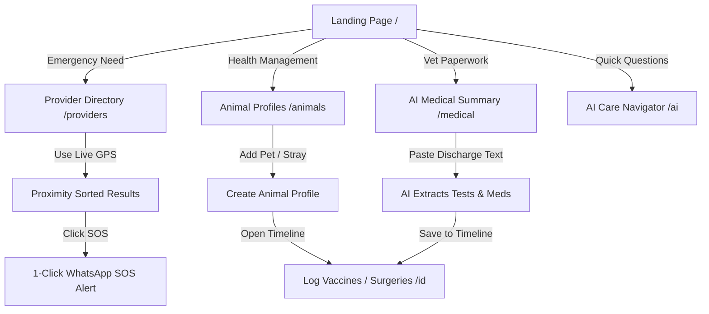

# 🐾 Pawzz (AnimalCare) — Product & Technology Screening Submission

> **Brief: "Practo for Animals"**  
> An open, location-aware digital platform connecting pet parents, rescuers, veterinarians, ambulances, and animal NGOs in India — powered by live Groq AI triage and automated clinical record management.

---

## 📌 1. Product Concept

### Who Would Use the Platform?
1. **Pet Parents:** Looking for verified local vets, emergency care after-hours, vaccination reminders, and an organized place to keep lifetime pet medical records.
2. **Animal Rescuers & Community Feeders:** Needing immediate emergency support for injured stray animals, rapid ambulance dispatch, and local NGO assistance without hunting through fragmented WhatsApp groups.
3. **Veterinary Clinics & Ambulances:** Looking to gain verified discovery, streamline emergency inbound calls, and digitize prescriptions and patient timelines.
4. **Animal Welfare NGOs & Shelters:** Coordinating rescue pickups, managing capacity, and tracking community animal sterilization/vaccination history.

---

### What Problem Would We Solve First?
**The "Golden Hour" Emergency & Discovery Gap.**  
When an animal is hit by a vehicle or suddenly falls critically ill at night, pet parents and rescuers face panic: phone numbers on Google Maps are often outdated, clinic timings are incorrect, and ambulances take hours to confirm availability over informal WhatsApp chats.

Our immediate focus is **verified, location-aware emergency discovery + 1-click emergency dispatch**, ensuring that help can be reached within minutes of distress.

---

### The 5 Prioritized Features (MVP Scope)
1. **📍 Live GPS Provider Discovery & Proximity Sorting:** Instant radius-based search across clinics, 24/7 emergency vets, ambulances, and NGOs using live browser geolocation.
2. **🚨 1-Click WhatsApp Emergency SOS & Dispatch:** Pre-formatted emergency dispatch modal that sends animal symptoms and location coordinates straight to on-call providers.
3. **📋 Unified Animal Profiles & Chronological Health Timeline:** A clean digital health card logging vaccinations, deworming cycles, surgeries, and doctor notes with next-due alerts.
4. **📄 AI Veterinary Document & Discharge Parser:** An automated tool that takes raw veterinary notes or prescription text and extracts structured observations, lab tests, medications, and follow-ups.
5. **🤖 Safety-Guardrailed AI Care Navigator:** A fast, contextual first-aid guide powered by Groq LLM with strict veterinary guardrails (refusing human medications and out-of-scope non-animal topics).

---

## 🗺️ 2. User Flows & Clickable Prototype

The codebase is a fully working, interactive Next.js application. Below are the key flows:



### Key Prototype Routes:
- [`/providers`](http://localhost:3000/providers) — Real-time distance calculation, service filter pills, radius slider, and WhatsApp SOS modal.
- [`/animals`](http://localhost:3000/animals) & [`/animals/[id]`](http://localhost:3000/animals/animal-bruno) — Dynamic animal health records, medical timeline, and vaccination tracking.
- [`/medical`](http://localhost:3000/medical) — AI document parser that extracts clinical insights and syncs them directly into any animal's profile.
- [`/ai`](http://localhost:3000/ai) — Full consultation screen with veterinary triage and instant navigation suggestions.
- **Floating AI Assistant** — Compact waving cat assistant in the bottom corner for quick access on any page.

---

## 🧠 3. AI & Automation Workflows

### 4 Core AI Workflows Implemented:

#### Workflow 1: Veterinary Document & Discharge Summary Extraction
- **Data Processed:** Free-text veterinary prescriptions, discharge summaries, and lab diagnostic notes.
- **What It Automates:** Reads messy clinical text and automatically isolates: (1) Key Observations, (2) Diagnostic Tests, (3) Prescribed Medications & Dosages, (4) Next Follow-Up Date.
- **Unique Original Touch:** An integrated **"Save to Animal's Medical Timeline"** button that automatically appends the parsed summary to the animal's persistent history without manual re-typing.

#### Workflow 2: Strict Safety-Guardrailed Triage Assistant
- **Data Processed:** User-reported symptoms (e.g., "my dog ate chocolate", "stray cat limping").
- **What It Automates:** Contextual triage recommendations, first-aid measures, urgency level (Immediate / Within 24h / Routine), and nearby provider referrals.
- **Safety Guardrail Engine:** Hardcoded veterinary guardrails that strictly:
  1. Refuse human medications (e.g. Paracetamol/Ibuprofen which are fatal to cats/dogs).
  2. Reject all out-of-scope queries (coding, politics, trivia).
  3. Enforce mandatory disclaimer that AI does not replace an in-person licensed veterinarian.

#### Workflow 3: 1-Click WhatsApp SOS Emergency Dispatch
- **Data Processed:** GPS coordinates, animal species, urgency notes, and emergency contact numbers.
- **What It Automates:** Formats a structured emergency dispatch message that opens directly in WhatsApp with one tap, reducing dispatch latency during road accidents or critical poisoning cases.

#### Workflow 4: Proactive Vaccination & Health Reminders (Concept)
- **Data Processed:** Vaccine dates (ARV, DHPPiL, Tricat) and deworming frequency.
- **What It Automates:** Calculates future booster due dates and highlights "Due Soon" / "Overdue" status badges across animal profile cards.

---

## 💻 4. Technology & Architecture

### Tech Stack
- **Frontend & Full-Stack Framework:** [Next.js 16](https://nextjs.org/) (App Router, Turbopack)
- **Programming Language:** TypeScript 5 (strict type safety throughout)
- **Styling:** Tailwind CSS (warm, accessible animal-care color system)
- **AI Inference:** [Groq Cloud](https://groq.com/) running `openai/gpt-oss-120b` (sub-second response latency for real-time triage)
- **Validation:** [Zod](https://zod.dev/) for strict runtime schema validation
- **Testing:** [Vitest](https://vitest.dev/) for unit and integration testing

### External APIs & Integrations Considered
1. **Groq Cloud API (`/chat/completions`):** High-speed LLM inference for care navigation and clinical report parsing.
2. **WhatsApp Cloud API / Deep-Linking (`https://wa.me/...`):** Direct zero-friction dispatch to rescuer and ambulance mobile numbers.
3. **HTML5 Geolocation + Haversine Formula:** Real-time distance calculation without costly third-party API dependencies in the MVP stage.
4. **Google Maps Directions API:** Direct route linking from provider cards to turn-by-turn navigation.
5. **AWS S3 / Cloudflare R2 (Planned):** For encrypted storage of PDF bloodwork reports and X-ray images.

---

## ⏱️ 5. MVP Thinking: 30-Day Execution Plan

If tasked with launching and validating this platform within 30 days:

### 🟢 What We Build in the First 30 Days (Ship Fast):
- **Verified Directory for 1–2 Major Metro Hubs:** Hand-verify top 100 veterinary clinics, emergency hospitals, and ambulance numbers in Delhi NCR / Bengaluru.
- **Mobile-Responsive Discovery Web App:** Lightweight PWA that loads instantly on slow 4G mobile networks with GPS proximity sorting.
- **WhatsApp SOS Integration:** Zero-friction dispatch using WhatsApp deep links (proven to have 95%+ adoption among Indian rescuers).
- **Core Animal Health Record:** Simple pet profile creation with vaccination logging and AI prescription text extraction.
- **Strict Guardrailed Triage AI:** Live AI consultation with strict safety guardrails against toxic medication advice.

### 🔴 What We Deliberately Leave Out (Cut for Phase 2):
- ❌ **In-App Payment Gateway & Escrow:** Direct payment to clinics adds friction; cash/UPI on-site is sufficient for MVP.
- ❌ **Complex Hospital ERP / Inventory Management:** Existing vets already use their own software; forcing a new billing system slows down clinic onboarding.
- ❌ **Live Video Telemedicine:** Requires expensive streaming infrastructure and complex doctor scheduling; text triage + phone referrals solve 80% of initial needs.
- ❌ **Hardware IoT GPS Collars:** High hardware overhead; start with digital microchip tag numbers and QR IDs.

---

## 🚀 Quickstart & Local Setup

```bash
# 1. Clone repository
git clone https://github.com/Utkarsh1087/Pawzz.git
cd Pawzz/pawzz

# 2. Install dependencies
npm install

# 3. Configure environment
cp .env.example .env.local
# Add your GROQ_API_KEY in .env.local

# 4. Run development server
npm run dev
# Open http://localhost:3000

# 5. Run test suite
npm test
```

---

## 🛠️ Tools & AI Platforms Used
- **Development & IDE:** Antigravity IDE / Cursor, VS Code
- **AI Models & Frameworks:** Groq Cloud (`openai/gpt-oss-120b`), Next.js 16 App Router
- **Design & Assets:** Custom Vanilla Tailwind CSS Design System, SVG mascots

---

*Submitted for the Product & Technology Intern Screening Assignment.*
